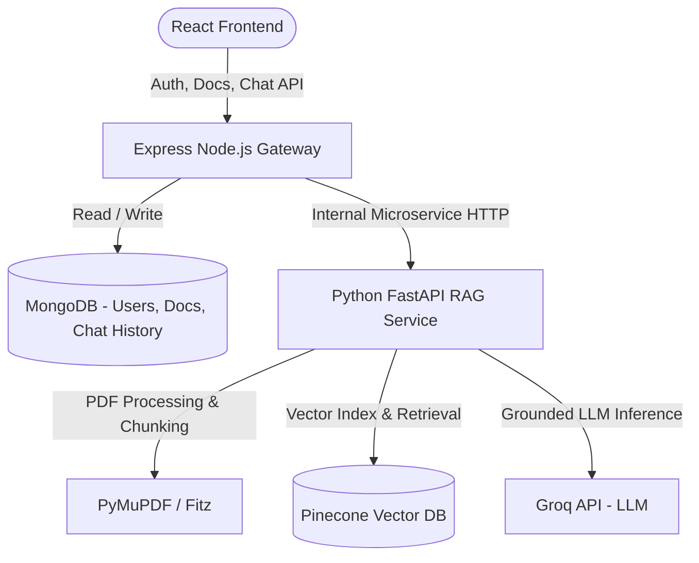

# Learning Platform with RAG AI Doubt Solver

An educational platform integrating student/mentor workflows with a Retrieval-Augmented Generation (RAG) powered AI Doubt Solver. The system enables students to upload course documents (PDFs), automatically extracts, chunks, and embeds text into Pinecone Vector DB, and provides grounded, citation-backed answers powered by Groq LLM.

---

## 🏗️ Target Architecture



### Gateway & Security Principles
- **React Frontend (`client/`)**: Modern Vite + React UI using a glassmorphic dark theme, file upload dropzone, document status tracker, and citation-aware doubt solver chat.
- **Node.js Express Backend (`server/`)**: Acts as the main public API gateway handling user authentication (JWT/bcrypt), document ownership authorization, MongoDB persistence, and microservice proxying.
- **Python FastAPI RAG Service (`rag-service/`)**: Isolated microservice performing PDF extraction (PyMuPDF), text chunking, local sentence embeddings (`sentence-transformers/all-MiniLM-L6-v2`), Pinecone vector operations, and grounded Groq LLM prompt generation.
- **Internal Service Protection**: FastAPI processing and query endpoints are protected using an internal service token header (`x-internal-secret`).

---

## 🚀 Features

- 🔑 **Authentication & Security**: Student / Instructor registration & login, password hashing with bcrypt, JWT token authorization, document and chat ownership isolation.
- 📄 **Document Vault**: PDF document upload (up to 10 MB limit), MIME validation, unique safe storage, live polling for vector indexing status (`uploaded` ➔ `processing` ➔ `processed` / `failed`).
- ⚡ **PyMuPDF Extraction & Chunking**: Configurable chunk size (500 chars) and overlap (50 chars) preserving page numbers and document metadata.
- 🌲 **Pinecone Vector Database Integration**: User-isolated namespace metadata filtering (`user_id` & `document_id`) ensuring zero cross-tenant data leaks.
- 🤖 **Grounded AI Doubt Solver**: Answers questions strictly from document context using Groq API (`llama-3.3-70b-versatile`), avoiding hallucinations and providing exact document and page number source citations.
- 💬 **Conversation History**: Chat history saved in MongoDB with document scope selection (query single doc or all processed materials).

---

## 📁 Repository Structure

```
.
├── client/                     # React + Vite Frontend
│   ├── src/
│   │   ├── components/         # Navbar, AuthView, DocumentManager, ChatInterface
│   │   ├── context/            # AuthContext (JWT management)
│   │   ├── services/           # API fetch helpers
│   │   ├── App.jsx
│   │   └── index.css           # Modern dark mode CSS design system
│   ├── package.json
│   └── vite.config.js
│
├── server/                     # Node.js + Express Main Backend Gateway
│   ├── config/                 # db.js (MongoDB Mongoose connection)
│   ├── controllers/            # authController, documentController, chatController
│   ├── middleware/             # authMiddleware, uploadMiddleware (Multer)
│   ├── models/                 # User.js, Document.js, Chat.js
│   ├── routes/                 # authRoutes, documentRoutes, chatRoutes
│   ├── uploads/                # Local PDF storage directory (git-ignored)
│   ├── app.js
│   ├── server.js
│   └── package.json
│
├── rag-service/                # Python FastAPI RAG Service
│   ├── app/
│   │   ├── config.py           # Pydantic Settings
│   │   ├── main.py             # FastAPI app initialization
│   │   ├── routes/             # health, documents, chat endpoints
│   │   └── services/           # pdf_service, chunking_service, embedding_service, vector_service, rag_service
│   ├── tests/                  # Pytest test suite (health, pdf chunking, endpoints)
│   ├── requirements.txt
│   ├── .env.example
│   └── README.md
│
├── README.md
└── package.json
```

---

## 🛠️ Setup & Installation Instructions

### Prerequisites
- Node.js 18+ and `npm`
- Python 3.10+
- MongoDB instance (Local or MongoDB Atlas URI)
- Free Pinecone API Key ([pinecone.io](https://www.pinecone.io/))
- Free Groq API Key ([groq.com](https://groq.com/))

---

### 1. Main Express Backend (`server/`)

1. Navigate to the `server/` directory:
   ```bash
   cd server
   ```

2. Install dependencies:
   ```bash
   npm install
   ```

3. Create `.env` file inside `server/`:
   ```env
   PORT=5000
   MONGO_URI=mongodb://localhost:27017/learning-platform
   JWT_SECRET=your_super_secret_jwt_key
   RAG_SERVICE_URL=http://localhost:8000
   INTERNAL_API_SECRET=your_internal_shared_secret
   ```

4. Start the Express server:
   ```bash
   npm run dev
   ```

---

### 2. Python FastAPI RAG Service (`rag-service/`)

1. Navigate to the `rag-service/` directory:
   ```bash
   cd rag-service
   ```

2. Create and activate a Python virtual environment:
   ```bash
   # Windows:
   python -m venv venv
   venv\Scripts\activate

   # Linux / macOS:
   python3 -m venv venv
   source venv/bin/activate
   ```

3. Install required Python packages:
   ```bash
   pip install -r requirements.txt
   ```

4. Create `.env` file inside `rag-service/`:
   ```env
   PORT=8000
   INTERNAL_API_SECRET=your_internal_shared_secret

   # Groq LLM Configuration
   GROQ_API_KEY=your_groq_api_key
   LLM_MODEL=llama-3.3-70b-versatile

   # Pinecone Configuration
   PINECONE_API_KEY=your_pinecone_api_key
   PINECONE_INDEX_NAME=learning-platform-docs
   PINECONE_NAMESPACE=default

   # Embedding Model
   EMBEDDING_MODEL=sentence-transformers/all-MiniLM-L6-v2
   EMBEDDING_DIMENSION=384
   CHUNK_SIZE=500
   CHUNK_OVERLAP=50
   ```

5. Start the FastAPI service:
   ```bash
   uvicorn app.main:app --host 0.0.0.0 --port 8000 --reload
   ```

6. Verify service health endpoint:
   ```bash
   curl http://localhost:8000/health
   # Returns {"status": "ok"}
   ```

---

### 3. React Frontend (`client/`)

1. Navigate to `client/`:
   ```bash
   cd client
   ```

2. Install dependencies:
   ```bash
   npm install
   ```

3. Start development server:
   ```bash
   npm run dev
   ```

4. Open `http://localhost:5173` in your browser.

---

## 🧪 Testing

### Running Python RAG Service Tests
```bash
cd rag-service
python -m pytest tests/
```

### Running Frontend Build Validation
```bash
cd client
npm run build
```

---

## 🔒 Security Measures

1. **Password Hashing**: Passwords stored using bcrypt with salt rounds = 10.
2. **JWT Authorization**: Bearer tokens verified on all protected API routes (`/api/documents/*`, `/api/chat/*`).
3. **Data Isolation**: Strict Mongoose query filtering on `userId` prevents users from viewing or deleting another user's documents or chats.
4. **Vector Database Isolation**: Pinecone vector queries enforce `filter={"user_id": str(user_id)}`.
5. **No Secret Exposure**: Groq, Pinecone, and JWT secrets are kept on the backend services and never sent to the React client.

---

## 📜 License

MIT License.
